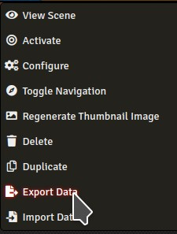

# Moulinette Bundler for FoundryVTT - Scenes

This page describes **How to contribute** by submiting new scenes.

## Prerequisites

* You need to have access to a [FoundryVTT](https://foundryvtt.com/) server as "GM" (game master)
* The scene must rely on a background image that is publiquely available on Internet

## Steps to create a bundle of scenes (novice)

* Create your scenes in Foundry VTT
* Export your scenes (Right clic | Export)



* Submit the exported scenes AND share the URL to the background images by either
  * [Creating an issue on GitHub](https://github.com/SvenWerlen/moulinette-data/issues)
  * [Posting a message on Discord](https://discord.gg/xg3dcMQfP2)

## Steps to create a bundle of scenes (advanced contributor)

* Create your scenes in Foundry VTT
* Export your scenes (Right clic | Export)
* Edit the exported file (`JSON` format)
  1. Remove the property `"img": "<some-background-path>"` *(delete the entire line, including the `,`)*
  1. Remove the property `"thumb": "worlds/...",` *(delete the entire line, including the `,`)*
  1. Remove the property `"_priorThumbPath": "worlds/...",` *(delete the entire line, including the `,`)*
* Create the bundle manifest
```json
{
  "id": "<pack-id>",
  "name": "<pack-name>",
  "description": "<pack-description>",
  "type": "scenes",
  "source": "<source-name>|<source-url>",
  "list": [
    {
      "name": "<scene-background-image-name-1>",
      "convert": "JPEG",
      "url": "<url-to-image-1>",
      "data": "<url-to-exported-scene-1>"
    },
    {
      "name": "<scene-background-image-name-2>",
      "convert": "JPEG",
      "url": "<url-to-image-2>",
      "data": "<url-to-exported-scene-2>"
    },
    ...
  ]
}
```

* **pack-id**: identifier of the pack. Must be unique. A folder with that name will be created in the module.
* **pack-name**: name of the pack. Displayed on [Moulinette Bundler](https://boisdechet.org/moulinette/bundler/fvtt/task) and [Readme](https://github.com/SvenWerlen/moulinette-data/tree/main/scenes).
* **pack-description**: description of the pack. Displayed on [Readme](https://github.com/SvenWerlen/moulinette-data/tree/main/scenes).
* **source-name** and **source-url**: source of the pack (where the image is from). Displayed on [Readme](https://github.com/SvenWerlen/moulinette-data/tree/main/scenes).
* **scene-background-image-name-1**: name of the first scene in the pack. Will be used as filename for the background image.
* **convert**: converts the image into JPEG format (better compression than PNG). Remove this option if the image is already in the right format.
* **url-to-image-1**: URL to the first background image to download from Internet
* **url-to-exported-scene-1**: URL to the first scene JSON (previously exported. See above)
* ...

*See [Old fishery (example)](https://github.com/SvenWerlen/moulinette-data/blob/main/scenes/pathfinder/curse-crimson-throne-old-fishery.json)*

* Create a pull request with all the files
  * 1 `JSON` for the pack
  * 1 `JSON` for each scene in the pack
* Submit and wait for approval
