# Moulinette Tokens

Data packs and frames for [Moulinette Tokenizer](https://github.com/SvenWerlen/moulinette/tree/master/tokenizer/README.md)

## Data Packs

| :exclamation: *Previews below contain portions of images from the internet. These images are protected by the copyright of their owners.* |
| :----------------------------------------- |

| Name | Preview | Type | # tokens |
| --- | --- | --- | ---: |
| [Dwarfs](packs/samples/dwarfs.json) |  | Round | 5 |
| [Fighters](packs/people/fighters.json) | 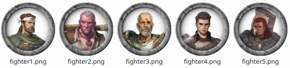 | Round | 8 |
| [Villagers Pack1 Cards](packs/people/villagers-pack1-cards.json) | 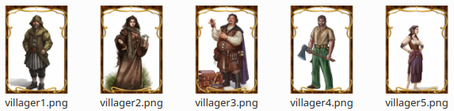 | Card | 10 |
| [Villagers Pack1](packs/people/villagers-pack1.json) | 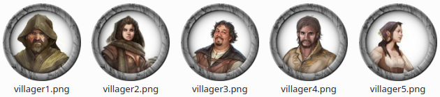 | Round | 10 |
| [Rise Runelords](packs/pathfinder/rise-runelords.json) | 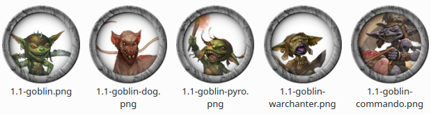 | Round | 36 |

## Frames

| Name | Preview | Type | Source / copyrights |
| --- | --- | --- | --- |
| [European](frames/card-european.png) | 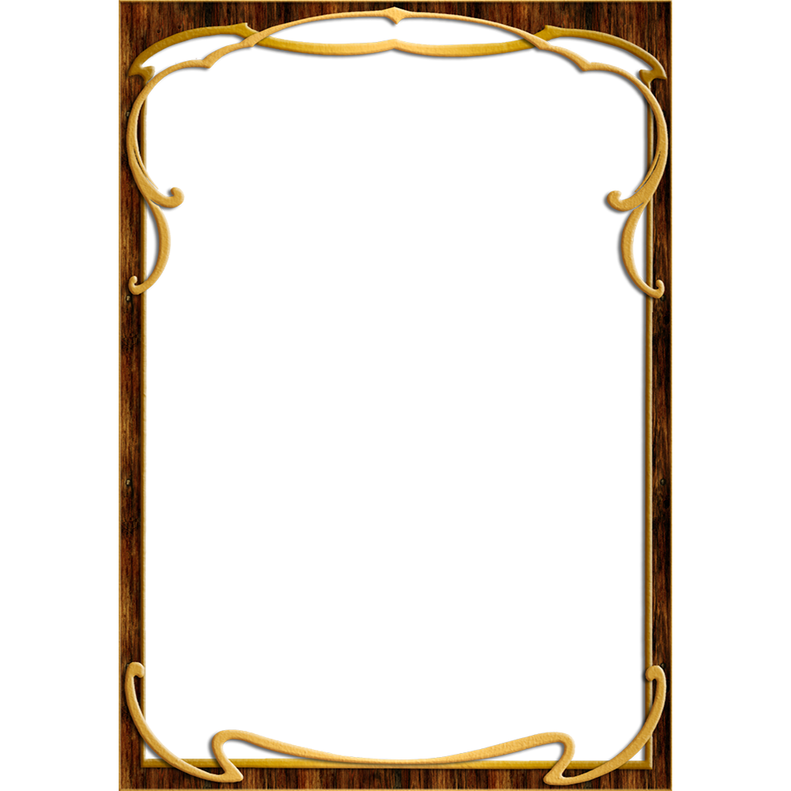 | Card | [RPTools](https://github.com/RPTools/TokenTool/tree/main/src/main/resources/net/rptools/tokentool/overlays/v2_1/Cards) |
| [Proxy](frames/card-proxy.png) | 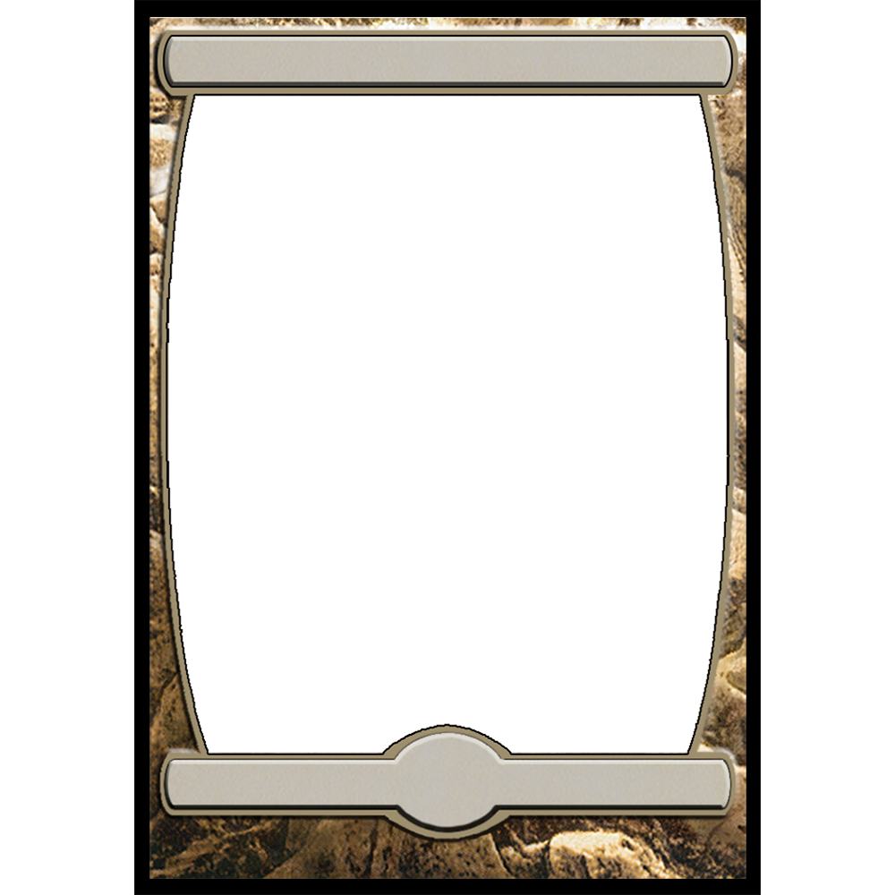 | Card | [RPTools](https://github.com/RPTools/TokenTool/tree/main/src/main/resources/net/rptools/tokentool/overlays/v2_1/Cards) |
| [Beige](frames/round-beige.png) |  | Round | [RPTools](https://github.com/RPTools/TokenTool/tree/main/src/main/resources/net/rptools/tokentool/overlays/v2/Round/Smooth) |
| [Brown](frames/round-brown.png) |  | Round | [VTTAssets](https://github.com/VTTAssets/vtta-tokenizer/tree/master/img) |
| [Circuitboard](frames/round-circuitboard.png) | 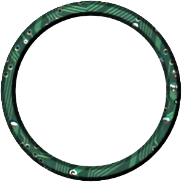 | Round | [RPTools](https://github.com/RPTools/TokenTool/tree/main/src/main/resources/net/rptools/tokentool/overlays/v2/Round/Smooth) |
| [Cobblestone](frames/round-cobblestone.png) | 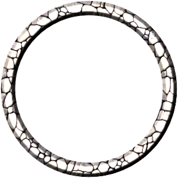 | Round | [RPTools](https://github.com/RPTools/TokenTool/tree/main/src/main/resources/net/rptools/tokentool/overlays/v2/Round/Smooth) |
| [Gear](frames/round-gear.png) |  | Round | [RPTools](https://github.com/RPTools/TokenTool/tree/main/src/main/resources/net/rptools/tokentool/overlays/v2/Round/Gears) |
| [Greenproto](frames/round-greenproto.png) | 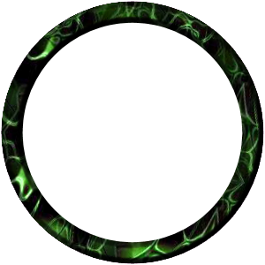 | Round | [RPTools](https://github.com/RPTools/TokenTool/tree/main/src/main/resources/net/rptools/tokentool/overlays/v2/Round/Smooth) |
| [Grey](frames/round-grey.png) | 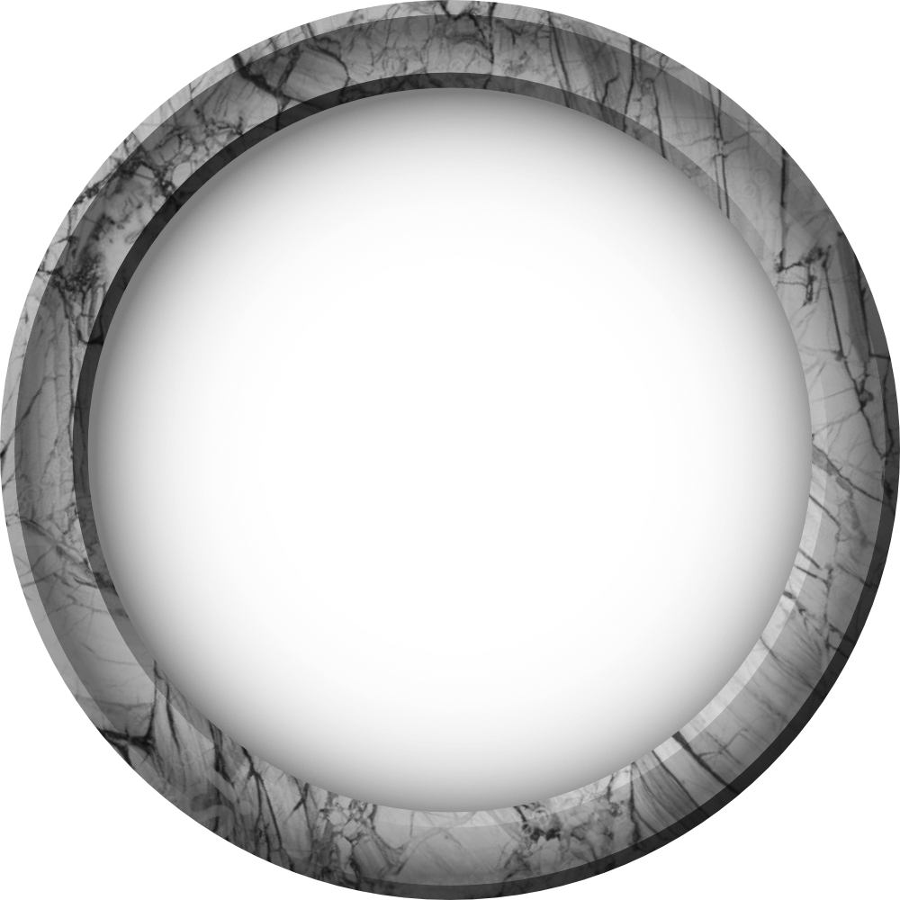 | Round | [VTTAssets](https://github.com/VTTAssets/vtta-tokenizer/tree/master/img) |
| [Lava](frames/round-lava.png) | 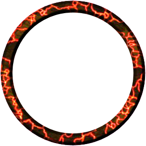 | Round | [RPTools](https://github.com/RPTools/TokenTool/tree/main/src/main/resources/net/rptools/tokentool/overlays/v2/Round/Smooth) |
| [Leaves](frames/round-leaves.png) | 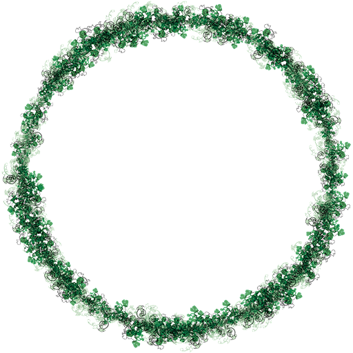 | Round | [RPTools](https://github.com/RPTools/TokenTool/tree/main/src/main/resources/net/rptools/tokentool/overlays/v2/Round/Decorated) |

